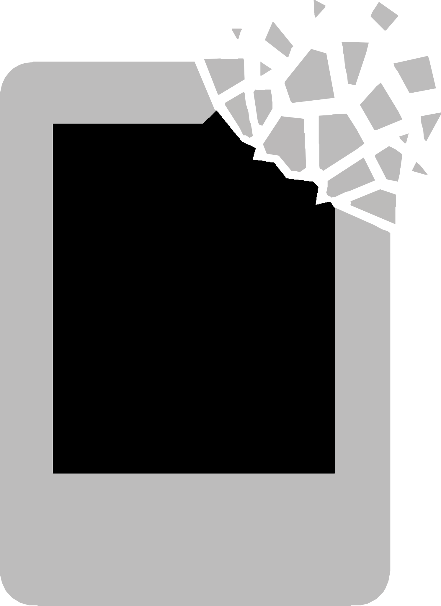

# &nbsp;&nbsp;fotonervic
*I hope you never have to use this. But if you do, I hope it helps.*

This web app recursively scans directories for corrupt, truncated, or damaged image and video files. For images, it attempts recovery where possible. Also extracts EXIF metadata with thumbnail previews across an entire directory.

Built for data recovery scenarios where hundreds or thousands of photos have been rescued from a failing drive but many are partially damaged. The scanner identifies every problem file, categorizes the damage, and offers one-click repair or salvage for supported image formats.

## Features

- **Recursive scanning** with real-time progress via Server-Sent Events
- **Folder-grouped results** with filtering by issue type
- **Repair JPEG** — re-encodes truncated JPEGs while preserving EXIF metadata and ICC profiles
- **Salvage Image** — recovers JPEGs with destroyed headers (missing SOI) using donor-table grafting and MCU-level remapping
- **Export Preview** — extracts embedded JPEG previews from RAW files that can't be fully decoded
- **EXIF Info** — scans every image and video for metadata: camera, date, settings, GPS coordinates, dimensions; displays as a lazy-loaded thumbnail card grid grouped by folder
- **Volume mount detection** — detects when a drive is mounted/unmounted in real time and shows a status indicator
- **Previous scans** — last 10 scans persisted to IndexedDB; restore any previous scan from a dropdown without rescanning
- **CSV export** of scan results and EXIF data
- **Directory browser** with breadcrumb navigation
- **Reveal in Finder/Explorer** — jump to any file from the UI

## Supported Formats

| Category | Extensions |
|----------|-----------|
| JPEG | `.jpg` `.jpeg` `.jpe` `.jfif` |
| PNG | `.png` |
| HEIC/HEIF | `.heic` `.heif` |
| TIFF | `.tif` `.tiff` |
| RAW | `.nef` `.nrw` `.arw` `.srf` `.sr2` `.cr2` `.cr3` `.dng` `.raf` `.rw2` `.orf` `.pef` `.srw` |
| Other | `.webp` `.bmp` `.gif` |
| Video | `.mp4` `.m4v` `.mov` `.avi` `.mpg` `.mpeg` |

## Quick Start

```bash
python3 app.py
```

Opens automatically at [http://localhost:5900](http://localhost:5900). Dependencies are installed on first run.

To use a different port:

```bash
python3 app.py 8080
```

## Requirements

- Python 3.8+
- Pillow >= 10.0.0

No external web framework needed — uses Python's built-in `http.server`.

Optional (installed automatically if available):

- **rawpy >= 0.18.0** — full RAW format support (NEF, ARW, CR2, CR3, DNG, RAF, RW2, ORF, PEF, SRW)
- **pillow-heif >= 0.13.0** — HEIC/HEIF support (iPhone photos)

Or install everything manually:

```bash
pip install -r requirements.txt
```

## Issue Types

| Status | Meaning |
|--------|---------|
| **Partial** | File is truncated — image data is incomplete. Repair may help. |
| **Corrupt** | Invalid headers, missing SOI marker, or destroyed structure. Salvage may help for JPEGs. |
| **EXIF Only** | File contains metadata but no recoverable image content. |
| **Empty** | File is 0 bytes. |
| **Unsupported** | Format requires an optional library that isn't installed. |
| **Error** | Permission denied or unexpected I/O error. |

## Recovery Techniques

### Repair JPEG

For **truncated** JPEGs where the header is intact but the file was cut short. The repair decodes all surviving pixel data using Pillow's truncation-tolerant mode, preserves the original EXIF metadata and ICC color profile, and re-encodes as a structurally clean JPEG. The result opens in any viewer without errors.

### Salvage Image

For **corrupt** JPEGs where the beginning of the file has been zeroed out (missing SOI marker). Three strategies are tried in order:

1. **Embedded tables** — if the file's own DQT/DHT/SOF0 tables survived, just prepend the SOI marker. This produces a perfect reconstruction with no data loss.

2. **Donor grafting + MCU remap** — finds a working JPEG from the same directory, extracts its quantization and Huffman tables, grafts them onto the surviving compressed data, then remaps MCU blocks to their correct grid positions using RST marker alignment. Recovers 80-95% of the image depending on how much data was zeroed.

3. **Simple graft** — for files without restart markers, grafts donor tables and decodes what's available. Content appears at the top; unrecoverable data is gray.

### Export Preview

For **RAW files** that can't be fully decoded, extracts the embedded JPEG preview that most cameras store inside the RAW container. This is typically a full-resolution JPEG that the camera generated at capture time.

## EXIF Info

Click **Exif Info** to scan every image and video in a directory for metadata. Results appear as a card grid grouped by folder. Each card shows:

- Thumbnail (lazy-loaded — only fetched as you scroll, handles 10k+ files efficiently)
- Camera make and model
- Capture time
- Exposure settings (aperture, shutter speed, ISO, focal length)
- Image dimensions and file size
- GPS coordinates (clickable link to Google Maps, when available)

Supports JPEG, PNG, HEIC, TIFF, WebP, and RAW formats. Videos show a placeholder icon.

## How It Works

The backend is `app.py` — a Python HTTP server (built on `http.server`, no framework) with a thread pool (4 workers) for parallel file checking. The frontend is split across `index.html`, `css/styles.css`, and `js/app.js`. No build step, no node_modules, no framework dependencies.

Scan results stream to the browser in real time via SSE. Each file is validated by a format-specific checker that examines container structure (headers, markers, atoms) and attempts a full Pillow decode. Previous scans are persisted to IndexedDB (last 10) and restored automatically on page load.

## License

MIT

---

Built with [Claude Code](https://claude.ai/claude-code) using Claude Opus 4.6
